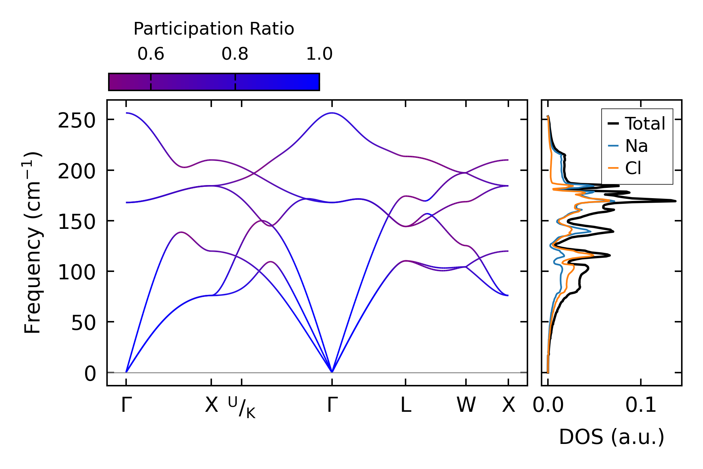
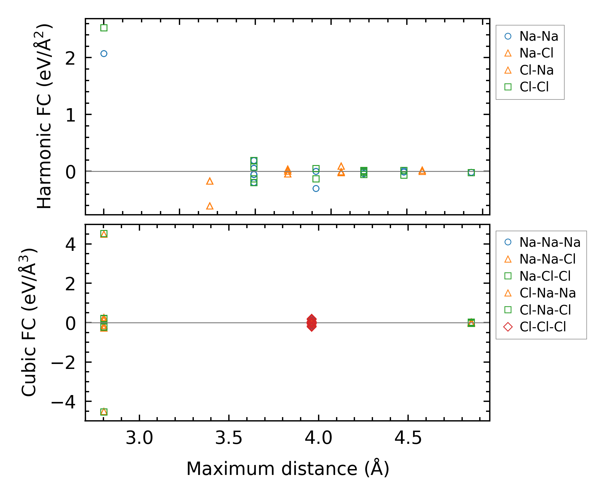

==============
Useful Tips
==============

Examples in this page assume that ``mp-22862`` (NaCl) has been computed using auto-kappa.
Please also see ``auto-kappa/examples/6_parser/basic``.

Make DFSET file for Alamode
===============================

.. literalinclude:: ./basic/make_dfset.py

.. literalinclude:: ./basic/DFSET.cube
   :lines: 1-10

Make BORNINFO file for ALAMODE
===============================

.. literalinclude:: ./basic/make_borninfo.py

Plot phonon dispersion and DOS
===============================

.. literalinclude:: ./basic/plot_bandos.py

    
    Phonon dispersion with participation ratio and DOS of Silicon

Plot force constants
====================

.. literalinclude:: ./basic/plot_fcs.py

    
    Force constants of NaCl

.. Plot results of cross validation
.. =====================================

.. .. code-block:: shell
    
..     $ ls
..     ... **.cvset1 **.cvset2 ... **.cvscore ...

.. .. code-block:: python

..     from auto_kappa.plot.lasso import plot_cvsets
..     plot_cvsets(directory='.', figname='fig_cvsets.png')
    
.. .. figure:: ../files/fig_cvsets.png
..     :height: 250px
..     :align: center

..     Results for cross-valication

