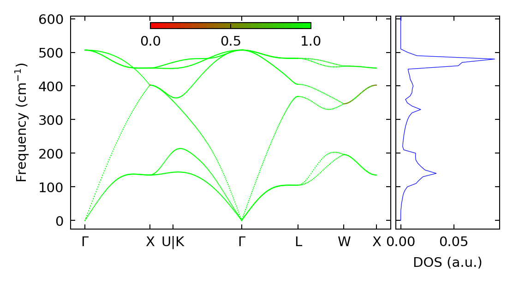
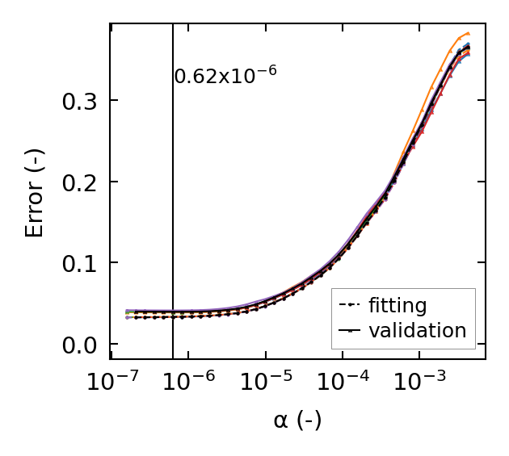

==============
Useful Tips
==============

Make DFSET file for Alamode
===============================

``get_dfset`` helps to make a DFSET file containing displacements and forces extracted from many vasprun.xml files.
Many directories which contain a vasprun.xml file are supposed to be located under the given directory.

.. code-block:: shell
    
    $ ls .
    1 2 3 4 ... prist

    $ ls ./1
    ... ... vasprun.xml ... ...

.. code-block:: python

    from auto_kappa.io.vasp import get_dfset
    
    directory = '.'
    offset_xml = directory + '/prist/vasprun.xml'
    outfile = 'DFSET'
    disps, force = get_dfset(directory, offset_xml=offset_xml, outfile=outfile)
..

Plot phonon dispersion and DOS
=================================

``plot_bandos`` helps to plot the phonon dispersion and DOS.
Different files such as .bands, .dos, .band.pr are supposed to be in the same directory.

.. code-block:: shell
    
    $ ls
    ... Si.bands Si.dos Si.band.pr ...
..

.. code-block:: python

    from auto_kappa.plot.bandos import plot_bandos

    plot_bandos(directory='.', prefix='Si',
                figname='fig_bandos.png',
                plot_pr=True)
..

    
    Phonon dispersion with participation ratio and DOS of Silicon

..

A more flexible way is as follows:

.. code-block:: python

    import matplotlib.pyplot as plt
    from auto_kappa.plot.alamode.band import Band
    from auto_kappa.plot.bandos import plot_bands_with_symmetry_points

    fig, ax = plt.subplots(figsize=(5, 3))
    
    file_band = 'Si.bands'
    band = Band(file_band)
    plot_bands_with_symmetry_points(ax, band)

    fig.savefig('fig_band.png', dpi=300, bbox_inches='tight')
    
..

Plot results of cross validation
=====================================

.. code-block:: shell
    
    $ ls
    ... **.cvset1 **.cvset2 ... **.cvscore ...

.. code-block:: python

    from auto_kappa.plot.lasso import plot_cvsets
    plot_cvsets(directory='.', figname='fig_cvsets.png')
    

    Results for cross-valication

